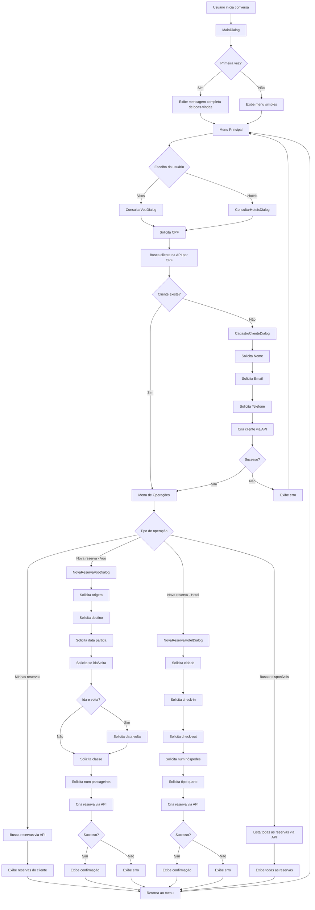

# Fluxo Detalhado do Chatbot - Diagrama de Estados

## Diagrama de Fluxo Principal



## Estados Detalhados por Dialog

### 1. MainDialog - Controle Principal

**Estados:**
- `initial_step`: Verifica se é primeira interação
- `show_menu_step`: Exibe opções (Voos/Hotéis)
- `route_step`: Redireciona para dialog específico

**Dados mantidos:**
- `primeira_vez`: Boolean para controlar mensagem de boas-vindas

### 2. ConsultarVooDialog / ConsultarHoteisDialog

**Estados:**
- `solicitar_cpf_step`: Coleta CPF do usuário
- `verificar_cliente_step`: Busca cliente na API
- `processar_opcoes_step`: Exibe menu baseado no resultado

**Fluxos possíveis:**
```
CPF → API → Cliente existe → [Minhas reservas | Nova reserva | Buscar disponíveis]
CPF → API → Cliente não existe → CadastroDialog → [Minhas reservas | Nova reserva | Buscar disponíveis]
```

### 3. CadastroClienteDialog

**Estados:**
- `nome_step`: Coleta nome
- `email_step`: Coleta email  
- `telefone_step`: Coleta telefone
- `confirmar_step`: Salva na API e confirma

**Dados coletados:**
```json
{
  "nome": "string",
  "email": "string", 
  "telefone": "string",
  "cpf": "string (já coletado anteriormente)"
}
```

### 4. NovaReservaVooDialog

**Estados:**
- `solicitar_origem_step`
- `solicitar_destino_step`
- `solicitar_data_partida_step`
- `solicitar_data_volta_step` (condicional)
- `solicitar_classe_step`
- `solicitar_passageiros_step`
- `confirmar_reserva_step`

**Dados coletados:**
```json
{
  "origem": "string",
  "destino": "string",
  "dataHoraPartida": "string",
  "dataHoraChegada": "string",
  "classe": "Econômica|Executiva|Primeira Classe",
  "numeroPassageiros": "integer",
  "preco": 500.0,
  "status": "CONFIRMADA",
  "cliente": {"id": "integer"}
}
```

### 5. NovaReservaHotelDialog

**Estados:**
- `solicitar_cidade_step`
- `solicitar_checkin_step`
- `solicitar_checkout_step`
- `solicitar_hospedes_step`
- `solicitar_tipo_quarto_step`
- `confirmar_reserva_step`

**Dados coletados:**
```json
{
  "nomeHotel": "Hotel {cidade} Plaza",
  "cidade": "string",
  "dataCheckIn": "string",
  "dataCheckOut": "string",
  "numeroHospedes": "integer",
  "tipoQuarto": "Standard|Deluxe|Suíte|Suíte Premium",
  "precoTotal": 200.0,
  "status": "CONFIRMADA",
  "cliente": {"id": "integer"}
}
```

## Integração com API

### Endpoints Utilizados pelo Chatbot

| Operação | Method | Endpoint | Usado em |
|----------|--------|----------|----------|
| Buscar cliente por CPF | GET | `/clientes/cpf/{cpf}` | ConsultarVoo/HoteisDialog |
| Criar cliente | POST | `/clientes` | CadastroClienteDialog |
| Buscar reservas voo por cliente | GET | `/api/reservas-voo/cliente/{id}` | ConsultarVooDialog |
| Buscar reservas hotel por cliente | GET | `/api/reservas-hospedagem/cliente/{id}` | ConsultarHoteisDialog |
| Criar reserva voo | POST | `/api/reservas-voo` | NovaReservaVooDialog |
| Criar reserva hotel | POST | `/api/reservas-hospedagem` | NovaReservaHotelDialog |
| Listar todas reservas voo | GET | `/api/reservas-voo` | Buscar disponíveis |
| Listar todas reservas hotel | GET | `/api/reservas-hospedagem` | Buscar disponíveis |

### Tratamento de Erros API

```python
# Padrão usado em todos os dialogs
result = await api_client.metodo_api(dados)

if result:
    # Sucesso - continua fluxo
    await step_context.context.send_activity(MessageFactory.text("✅ Sucesso!"))
    return await step_context.end_dialog(result)
else:
    # Erro - informa e retorna
    await step_context.context.send_activity(
        MessageFactory.text("❌ Erro na operação. Tente novamente.")
    )
    return await step_context.end_dialog()
```

## Dados de Teste Disponíveis

### Clientes Pré-cadastrados
```json
[
  {
    "id": 1,
    "nome": "João Silva",
    "cpf": "123.456.789-00",
    "email": "joao@email.com",
    "telefone": "11999999999"
  },
  {
    "id": 2,
    "nome": "Maria Santos", 
    "cpf": "987.654.321-00",
    "email": "maria@email.com",
    "telefone": "11888888888"
  }
]
```

### Reservas de Teste
- João Silva tem reservas de voo e hotel
- Maria Santos tem reservas de voo e hotel
- Dados podem ser consultados via API ou H2 Console

## Cenários de Teste Funcionais

### Cenário 1: Cliente Novo
1. Digite CPF inexistente (ex: 111.111.111-11)
2. Sistema detecta que não existe
3. Solicita cadastro (nome, email, telefone)
4. Salva na API
5. Retorna ao menu de operações

### Cenário 2: Cliente Existente
1. Digite CPF existente (123.456.789-00)
2. Sistema reconhece João Silva
3. Vai direto para menu de operações

### Cenário 3: Nova Reserva de Voo
1. Cliente logado
2. Escolhe "Nova reserva"
3. Preenche: São Paulo → Rio de Janeiro, 15/11/2025, Ida e volta, 16/11/2025, Econômica, 2 passageiros
4. Sistema salva na API
5. Exibe confirmação com código da reserva

### Cenário 4: Consultar Reservas
1. Cliente logado (João Silva)
2. Escolhe "Minhas reservas"
3. Sistema busca na API
4. Exibe lista de reservas existentes

---
**Nota**: Este fluxo representa o estado atual (95% funcional) com exceção do problema no arquivo `nova_reserva_hotel.py`